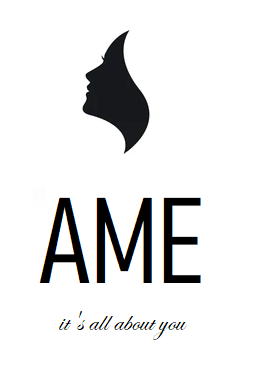
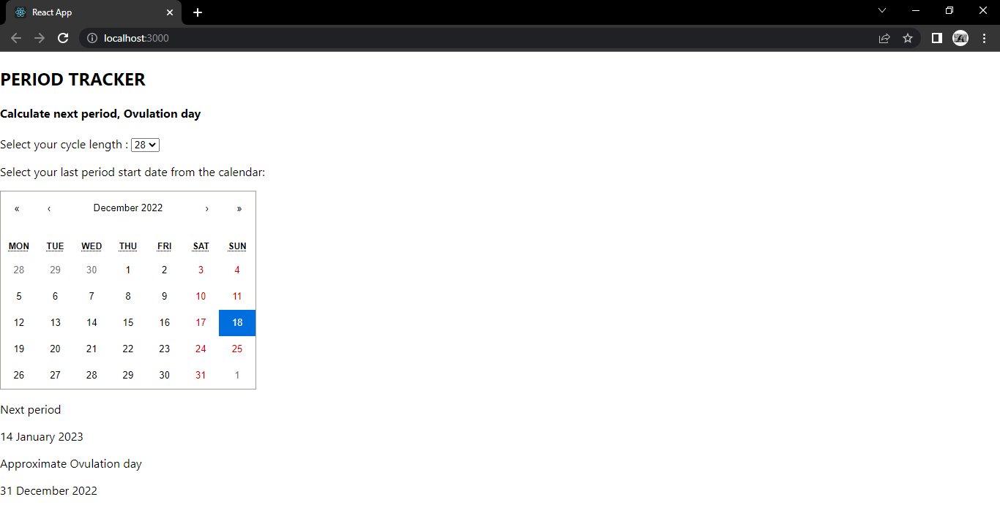
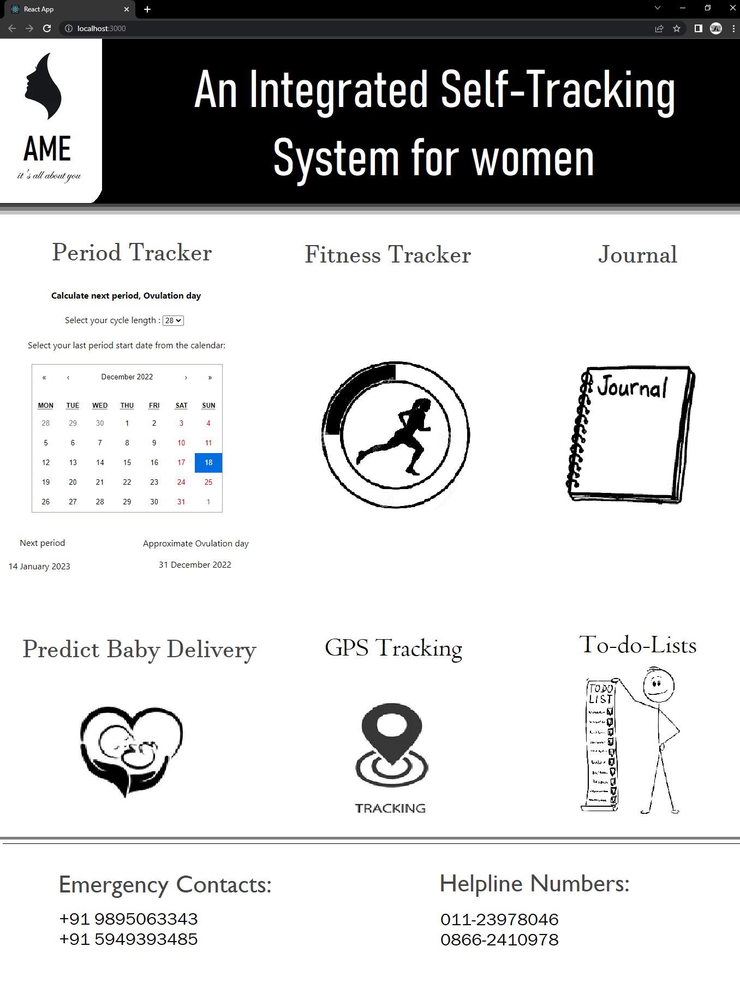

 
 # WebApp for Women 
<p align="center">
 
</p>
<p>
Most people spend days upon days talking about empowering women and making their lives easier but only very few take steps to implement it. Let alone maintain proper hygiene, most people aren't even fully aware of their own options. In a society full of superstitious beliefs clogging people's minds and leading them to mistreat the women in their family, there MUST be some glimmer of education!
We believe it's the small things that count. Therefore, we decided to develop AME, an integrated self-tracking system that acts like a friend to women. 
The features of our web app are: Period Tracking, Fitness guide, Journaling, Prediction of baby delivery, GPS Tracking - a safety feature for women's security and task Management. Out of which we were successfully able to deploy the period tracking feature.
 
This app is developed with the intention of giving girls the knowledge they lack about their own health, charting out the hormonal cycles of people, and letting them keep an eye on their physical and mental well-being.
</p>

 ***We're thankful for this opportunity because this project helped us to understand the workflow of creating a web app using React.js. We got to know about several modules in React.js which were used for certain needs in the project. Overall it was a great learning experience.***
 
<br/>

## Team members:

**1.** [ANUSHA JOSEPH](https://github.com/anushajoseph)<br/>
**2.** [ANNROSE PAUL](https://github.com/ann018)<br/>
**3.** [ANGEL MARY SHIBU](https://github.com/angelmaryshibu)

## Link to product walkthrough:
 
https://www.loom.com/share/9757e7012f4a4cd2b2d5a1a25027eb8b

## Packages used:
 
- react-moment

- react-calendar 

## How to configure:
**1.** Install  Visual Studio Code (VSC)

```shell
$ https://code.visualstudio.com/
```

**2.** Clone this repository to your local drive

```shell
$ git clone https://github.com/anushajoseph/AME
```

**3.** Install dependencies

```shell
$ npm i react-moment react-calendar
```

**4.** Open Terminal and Run using the command: npm start

```shell
$ App.js
```

## How it works:
 
**1.** First we made a project directory using the command: npx create-react-app ame
 
**2.** Imported Moment from "react-moment" to work with the dates. 
 
**3.** Imported Calendar from "react-calendar" to select the last period date.
 
**4.** User should select their period cycle length and then her last period start date from the calender.
 
**5.** With the help of these two values we can estimate the date of the next period.
 
**6.** Added basic commands in the code.
 
**7.** It is all set to run.

We have added prediction of baby delivery and to-do-list features which are to be completed. Rest of the features have to be added soon.
## Actions performed:
 
<table>
<tr>
<td><h5>COMMAND</h5></td>   
<td><h5>OUTPUT</h5></td>
</tr>
<tr>
<td>Cycle Length</td>		   
<td>Number</td>
</tr>
<tr>
<td>Last period date</td>		   
<td>Next period & approx. ovulation day</td>
</tr>
</table>

## WEB APP deployed:
<p align="center">

 </p>

## WEB APP prototype:
<p align="center">

 </p>
 
<p align="center">
🌟 Star this repository if you find it useful.
</p>
